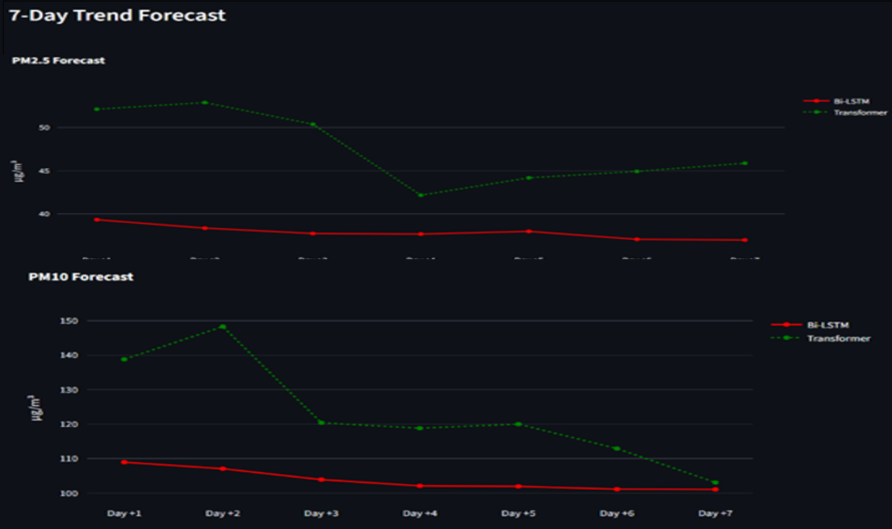
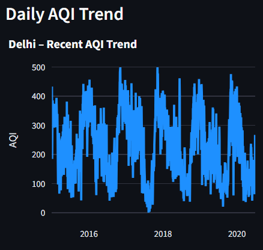
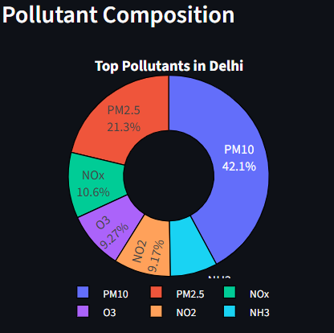

# SmogCast: Predicting & Forecasting Air Quality in India

**SmogCast** is an end-to-end air quality analytics and forecasting system that transforms raw air-pollution sensor data into **actionable insights**.  
It performs **real-time AQI classification** and **7-day forecasting** of particulate matter (PM2.5 & PM10) using a hybrid machine-learning and deep-learning pipeline.

 **Live App:** https://smogcast.streamlit.app/  
 **Demo Video:** https://youtu.be/UyUvtBF0N3Q  

---

## 📌 Key Features

- **Real-Time AQI Classification** (Good → Severe)
- **7-Day Forecasting** of PM2.5 & PM10
- **Hybrid Modeling**
  - CatBoost for classification
  - Bi-Directional LSTM & Transformer for forecasting
- **Class Imbalance Handling** using SMOTE
- **Advanced Feature Engineering** (lags, rolling means, cyclical encoding)
- **Interactive Streamlit Dashboard**
- **Fast Inference** using pre-trained models

---

## Repository Structure

```bash
SmogCast-Predicting-and-Forecasting-Air-Quality-in-India/
│
├── app.py                     # Streamlit dashboard application
├── city_hour.csv              # Air quality dataset (2015–2020)
├── catboost_model.cbm         # Trained CatBoost classification model
├── lstm_model.keras           # Trained Bi-LSTM forecasting model
├── transformer_model.keras    # Trained Transformer forecasting model
├── scaler.pkl                 # MinMaxScaler for normalization
├── encoders.pkl               # Encoders for categorical features
├── requirements.txt           # Project dependencies
├── .devcontainer/             # Dev container configuration
├── assets/                    # Dashboard & visualization images
│   ├── dashboard_overview.png
│   ├── aqi_gauge.png
│   ├── forecast_lstm_transformer.png
│   ├── daily_aqi_trend.png
│   └── pollutant_composition.png
└── README.md


---

## Streamlit Dashboard Preview

The SmogCast dashboard provides an intuitive interface for monitoring **current air quality** and **future pollution trends** across major Indian cities.

### Full Dashboard Overview


---

## Key Visual Components

### AQI Classification & Severity Gauge

This gauge visualizes the **current AQI category** mapped to CPCB color-coded breakpoints (Green → Maroon), allowing instant assessment of air quality severity. Adjecent to it we have the AQI classification label along with recommendation message.


---

### 7-Day Forecast (Bi-LSTM vs Transformer)

Compares forecasting behavior across deep-learning models.
The **Bi-LSTM** produces smoother, more stable trends, while the **Transformer** reacts more sharply to daily fluctuations.



---

### Daily AQI Trend

Displays short-term AQI fluctuations for the selected city, revealing smog spikes, recovery phases, and temporal patterns.



---

### Pollutant Composition

Illustrates the relative contribution of dominant pollutants (PM2.5, PM10, NO₂, SO₂, etc.) to the city’s overall air quality.



---

## Methodology Overview

### 1️⃣ Data Processing Pipeline

* **Hierarchical Imputation**

  * City-level median fill
  * Zero-fill fallback for missing sensors
* **Temporal Aggregation**

  * Hourly → Daily averages
* **Feature Engineering**

  * Lag features (t-1)
  * 7-day rolling means
  * Cyclical time encoding (sin/cos)
* **Scaling**

  * Log1p transformation
  * MinMax scaling to [0,1]

---

### 2️⃣ AQI Classification (CatBoost)

* Multi-class AQI prediction (Good → Severe)
* Native handling of categorical city features
* SMOTE applied to improve minority (“Severe”) detection
* **Global Test Accuracy:** **92.39%**
* **High Precision (>94%)** for Severe AQI events

---

### 3️⃣ Forecasting Models

| Model                   | Strengths                                               |
| ----------------------- | ------------------------------------------------------- |
| **Bi-Directional LSTM** | Smooth, stable forecasts; lowest MAE                    |
| **Transformer**         | Captures long-range dependencies but sensitive to noise |

**Key Insight:**

> For this dataset size, the Bi-LSTM outperformed the Transformer, demonstrating that simpler architectures can outperform more complex models when data quality and feature engineering are strong.

---

## Running the App Locally

```bash
# Clone the repository
git clone https://github.com/silverfrost702/SmogCast-Predicting-and-Forecasting-Air-Quality-in-India.git
cd SmogCast-Predicting-and-Forecasting-Air-Quality-in-India

# Install dependencies
pip install -r requirements.txt

# Run the Streamlit app
streamlit run app.py
```

---

## Deployment Strategy

* **Model Training:** Offline (GPU-based Google Colab)
* **Inference:** Lightweight CPU-based inference
* **Prediction Latency:** < 1 second
* **Deployment:** Streamlit Cloud

---

## Future Enhancements

* Integrate meteorological data (wind speed, humidity)
* Hyperparameter tuning for Transformer
* City-specific health advisories
* Real-time data ingestion via APIs

---

## Academic Context

This project was developed as part of
**IE 6318 – Data Mining & Analytics**
*University of Texas at Arlington*

---

## References

1. Central Pollution Control Board (CPCB), National Air Quality Index
2. Prokhorenkova et al., *CatBoost: Unbiased Boosting with Categorical Features*, NeurIPS (2018)
3. Vaswani et al., *Attention Is All You Need* (2017)
4. Chawla et al., *SMOTE: Synthetic Minority Over-sampling Technique*, JAIR (2002)
5. Kaggle: *Air Quality Data in India (2015–2020)*

---

## Author

**Anuva Negi**
MS in Data Science — University of Texas at Arlington

```